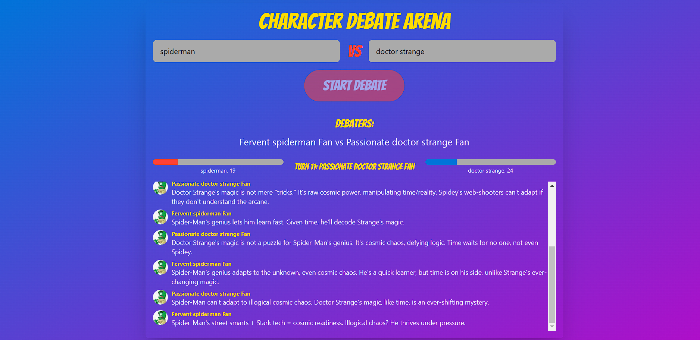

# LLM-Battle



## Reasons for building this
- To put a stop over anime quarrels.
- To test llm capabilities.

## Getting Started

1. Clone the repository
2. Install dependencies with `npm install`
3. Create a `.env.local` file and add your API keys:   ```
   OPENAI_API_KEY=your_openai_api_key_here
   TAVILY_API_KEY=your_tavily_api_key_here   ```
4. Run the development server with `npm run dev`
5. Open [http://localhost:3000](http://localhost:3000) in your browser

## Contributing

We welcome contributions to the LLM-Battle project! Please read our contributing guidelines before submitting pull requests.

## License

This project is licensed under the MIT License. See the LICENSE file for details.
